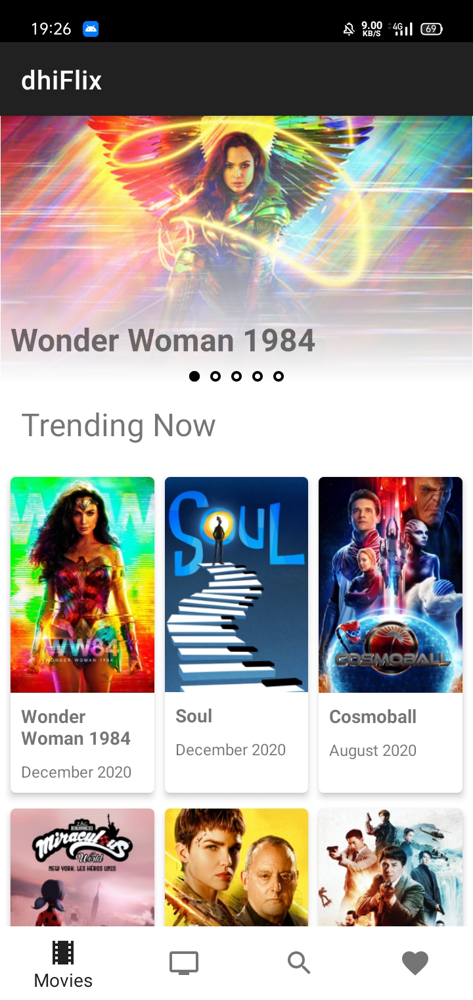
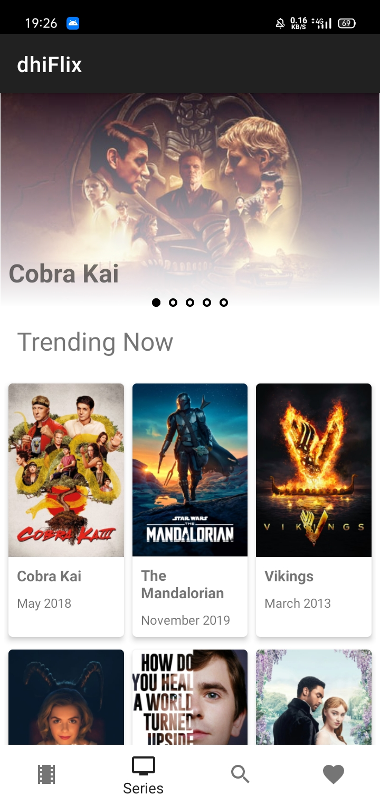
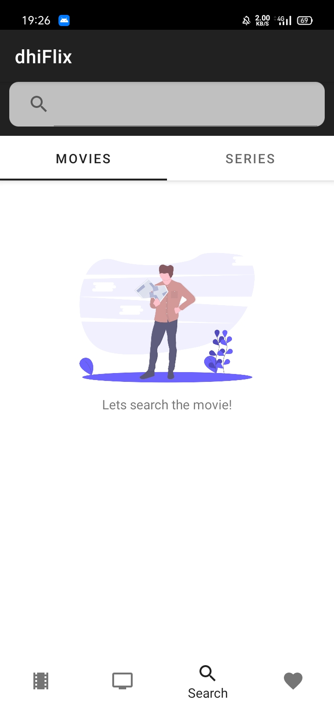
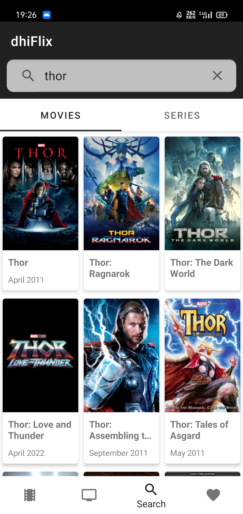
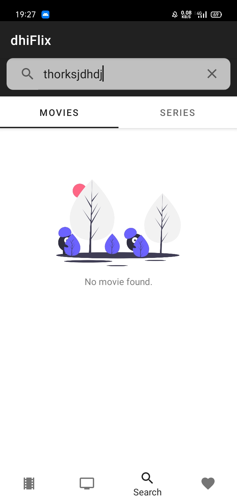
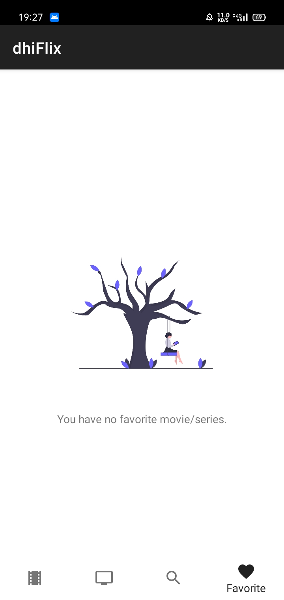
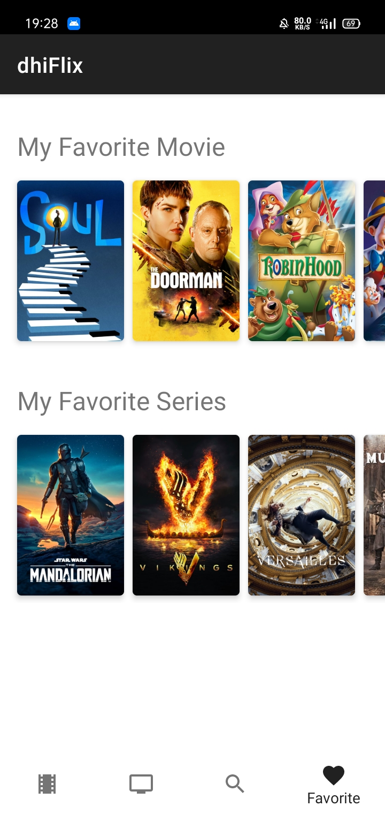
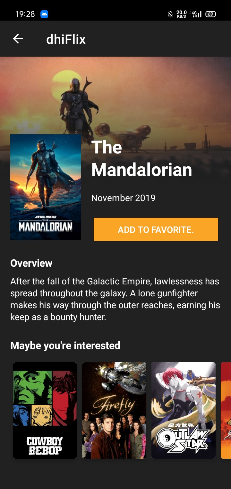

# dhi-movie

This project is about a movie catalog that I done on my final submission from [Dicoding](https://www.dicoding.com/) in class [Menjadi Android Developer Expert](https://www.dicoding.com/academies/165) which is the last class from [Android Developer Learning Path](https://www.dicoding.com/learningpaths/7). The data used in this app is from [TheMovieDB](https://developers.themoviedb.org/3). I'm so happy because I received 5 stars on this submission. I hope this project can be useful for you as a learning reference.

  

## Features
- MVVM + Clean Architecture
- Modularization
  - Module [:core](https://github.com/ghi4/dhi-movie/tree/master/core) as library module
  - Module [:favorite](https://github.com/ghi4/dhi-movie/tree/master/favorite) as dynamic-feature module
- Koin for dependency injection
- Kotlin Coroutines for handling data flow
- Shimmer for loading animation
- Leak Canary for memory leak detection

## Security
- SQLCipher for local database encryption
- Obfuscation
- Certificate Pinning

## Screenshots
<h3 align="center"> Movie List and Series List </h3>

  
  

<h3 align="center"> Search Page </h3>

  
  
  

<h3 align="center"> Favorite Page </h3>

  
  

<h3 align="center"> Detail Page </h3>

  

